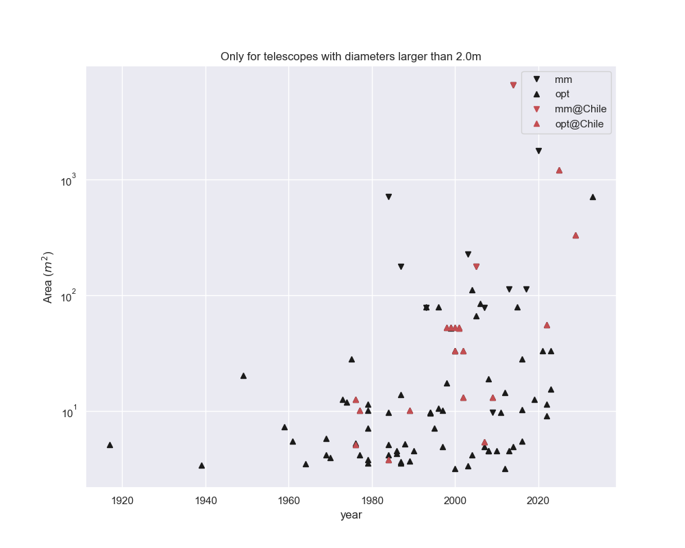

# telstats
A Class to do quick worldwide telescope statistics. Optical telescope data is read directly
from wikipedia tables. Code works with table format as of May 2020. If the format of those
tables change, code would need to be adapted.

Try:

```
import telstats

ts = telstats.TelStats()
ts.plot_fraction_region(site_ref="Chile", min_diameter=3)
ts.plot_area_time()
ts.plot_show()
```

try options `x_style=bar|line|none` and `x_params={<plot_custom_params>}`
for `x` any of `opt, mm, both, total, opt_total, mm_total` 

Sample output





**Author**:
 * Patricio Rojo <pato@das.uchile.cl>
 * Contributors welcome!